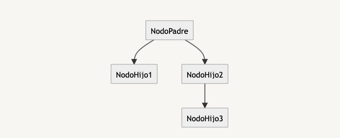
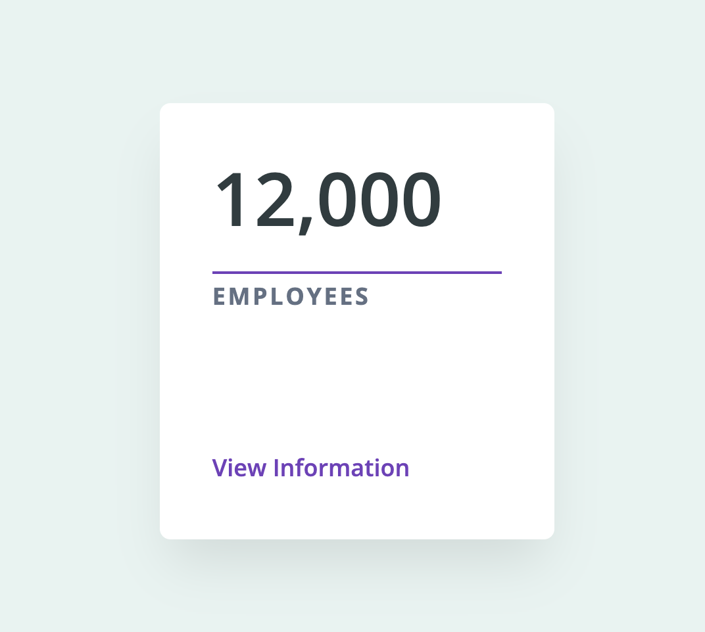

## DOM: Document Object Model

El DOM es como un árbol. Cada etiqueta es llamado Nodo (Node, en inglés) y cada Nodo tiene otros Nodos unidos a él, es decir: Un Nodo puede ser el padre de otros Nodos.

> ¿Cuál es el nodo padre de NodoHijo3?
> 



Explicación:

El gran papa es el NodoPadre pero el papa directo del NodoHijo3 es el NodoHijo2 porque es en el que se encontra el contenido de lo que contiene el NodoHijo3.

> ¿Cuáles son los Nodos Hijos de NodoHijo5? 
¿Cuáles son los Nodos Hijos de NodoHijo1?
> 


Explicación:

El Nodo Hijo de NodoHijo5 es el NodoHijo6

Los Nodos Hijos de NodoHijo1 son NodoHijo4 y NodoHijo5

### Para los problemas siguientes crea un directorio con los archivos:

- index.html
- script.js

> Agrega el siguiente código html en `index.html` y luego usa la etiqueta script para vincular el archivo `script.js`
> 

```html
<!DOCTYPE html>
<html lang="en">
<head>
    <meta charset="UTF-8">
    <meta http-equiv="X-UA-Compatible" content="IE=edge">
    <meta name="viewport" content="width=device-width, initial-scale=1.0">
    <title>Document</title>
</head>
<body>
    
</body>
</html>
```

Explicación:

Tengo varias posibilidades para vincular mi archivo script.js en el archivo html. 

Las dos maneras mas utilizadas :

- En el head de mi archivo html con `defer` . Mientras que sera en el head, el defer permite decirle al navegador de ejecutar este archivo luego de haber analizado el documento completo.
- El el body, antes de que se cierra esta misma etiqueta con la balise `script`. Permite que todo el documento sea analizado y luego el javascript.

El lugar de la etiqueta script tiene un gran importancia. Primero el navegador tiene que analizar el html y luego el javascript para dar el tiempo al html de ser cargado antes. Eso evitara las errores y accelera el tiempo de respuesta del sitio web.

> En el archivo `script.js` haz un `console.dir(document)` abre el archivo `index.html` en tu navegador para poder probar y explicar qué tipo de dato aparece en la consola.
> 

Explicación:

Un object porque tiene todas las propiedades del document y eso lo hace un objeto. 

> Dentro de la etiqueta `<body></body>` crea una etiqueta `div` y agrégale un atributo `id` con el valor de `"my-div"`  y dentro de la etiqueta `div` pon tu frase favorita.
> 

```html
<div id="my-div"></div>
```

Luego, en el archivo `script.js`  haz lo siguiente:

```jsx
const elem = document.getElementById('my-div');
console.log(elem.outerHTML); // Describe lo que aparece aquí.
console.log(elem.textContent); // Describe lo que aparece aquí.
```

Explicación:

console.log(elem.outerHTML); → <div id="my-div">Everything will be ok</div>

Element.outerHTML obtiene el fragmento HTML serializado (conversion/tomar el elemento del DOM y lo convierte en un string) que describe el elemento incluyendo sus descendientes.

console.log(elem.textContent); → Everything will be ok

> Ahora, sin borrar lo que hiciste anteriormente podemos cambiar el texto que está dentro del `div`:
> 

```jsx
elem.textContent = '¡Viva JavaScript!';
// Revisar la pantalla.
```

Explicación:

.textContent modifica el contenido del texto en el navegador. Ahora se ve ¡Viva JavaScript! y no Everything will be ok.

> Ahora, usando la función `prompt` pide el nombre al usuario y haz que el nombre aparezca como texto del `div`.
> 

Explicación:

```jsx
elem.textContent = prompt('¿ Como se llama ?');
```

He utilizado la function `prompt()` que abre un modal y sirve para pedir algo al usuario y recibir su respuesta.

Luego he agregado la propiedad elem.textContent para modificar el texto en el navegador. 

> Ahora vamos a crear una lista `ul` .
> 

```html
<ul id="list"></ul>
```

En el archivo `script.js` vamos a crear un elemento `li` con un texto :

```jsx
const list = document.getElementById('list'); // Explicar:
const item = document.createElement('li'); // Explicar:
item.textContent = 'Javascript'; // Explicar:
list.append(item);  // Explicar:
```

Explicación:

- const list = document.getElementById('list'); → Permite de obtener un elemento via su ID. Como los Id son unicos tiene una referienca unica y va directamente a buscar el elemento que queremos.
- const item = document.createElement('li'); El metodo .createElement('') crea un elemento HTML. Aqui se ha creado una lista en el elemento ‘list’
- item.textContent = 'Javascript'; → item.textContent modifica el texto en el navegador. Se va a agregar el texto ‘Javascript’.
- list.append(item);  → El metodo .append() agrega un conjunto de objetos Node o cadenas después del último elemento.

> En el archivo `index.html` hacer esta tarjeta con la ayuda de un archivo `styles.css`
> 



La etiqueta que tiene el valor de `12,000` debe tener un `id` con el valor de `amount`, la etiqueta que tiene el valor de `EMPLOYEES` debe tener un `id` con el valor de `title`.

Ahora, desde el archivo `script.js` crear un objeto con las propiedades `amount` y `title` con los valores que muestra la imagen. 

Con la ayuda de `document.getElementById` y de los id que se pusieron en el `index.html` poner el texto con `textContent` 

Explicación:

```html
<!DOCTYPE html>
<html lang="es">
  <head>
    <meta charset="UTF-8" />
    <meta http-equiv="X-UA-Compatible" content="IE=edge" />
    <meta name="viewport" content="width=device-width, initial-scale=1.0" />
    <link rel="stylesheet" href="27style.css" />
    <title>etiqueta hecho con js</title>
  </head>
  <body class="body">
    <div class="style-etiqueta">
      <div class="number" id="amount"></div>
      <div class="title" id="title"></div>
      <div class="info">view information</div>
    </div>

    <script src="27.js"></script>
  </body>
</html>
```

```css
.body {
  background-color: rgb(231, 244, 241);
  font-family: system-ui;
}

.style-etiqueta {
  background-color: white;
  width: 200px;
  height: 230px;
  border-radius: 10px;
  padding: 25px 20px;
  box-sizing: border-box;
  box-shadow: 0px 0px 30px 0px #d1d1d1;
  margin: 20% auto;
}

.number {
  font-size: 35px;
  font-weight: 450;
  color: rgb(47, 60, 64);
}

.title {
  font-size: 12px;
  color: grey;
  font-weight: 600;
  border-top: 2px solid rgb(143, 75, 200);
  margin-top: 15px;
  letter-spacing: 1px;
  padding-top: 4px;
}

.info {
  font-size: 12px;
  color: rgb(143, 75, 200);
  font-weight: 550;
  margin-top: 90px;
}
```

```jsx
let obj = {
  amount: "",
  title: prompt("Ingresa un titulo"),
};

/* while (typeof obj.amount === NaN || typeof obj.amount === "string") {
  obj.amount = +prompt("Ingresa un numero");
} */

do {
  obj.amount = +prompt("Ingresa un numero");
} while (typeof obj.amount === NaN);

let amount = document.getElementById("amount");
amount.textContent = obj.amount;

let title = document.getElementById("title");
title.textContent = obj.title;
```